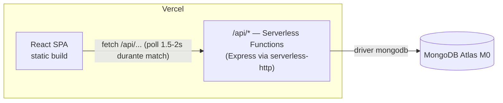

# BlinkyChess — Piano di ricostruzione

> Documento di pianificazione. Nessun codice viene toccato finché non lo approvi punto per punto — è la base per allineare le decisioni prima di iniziare il lavoro vero.

## 0. Decisioni già prese (confermate in chat)

| Tema | Decisione |
|---|---|
| Real-time & hosting | **Polling** (no WebSocket) + **tutto su Vercel** (frontend statico + API serverless) |
| Validazione mosse | **Server autoritativo** — il client manda solo l'intento (`from`/`to`/`promotion`), il server verifica e applica |
| Sicurezza auth | **bcrypt** per le password + **sessioni vere** (JWT in cookie httpOnly), niente più password in `sessionStorage` |
| Extra oltre alle 4 richieste base | **Storico/replay partite**, **Leaderboard**, **Matchmaking migliorato** (coda server-side senza race condition) |

Tutto il resto di questo documento discende da queste 4 scelte.

---

## 1. Stack e hosting (100% gratuito)

| Livello | Scelta | Perché |
|---|---|---|
| Frontend | **Vercel** (static hosting) | Build React/Vite, deploy automatico da GitHub, CDN, SSL gratis, generoso free tier |
| Backend | **Vercel Serverless Functions** (stesso progetto, cartella `/api`) | Un solo deploy per frontend+backend, zero server da tenere sveglio, zero costi |
| Database | **MongoDB Atlas M0** (free forever, 512MB) | Già in uso, nessun motivo per cambiare, schema a documenti adatto al dominio |
| Realtime | **Polling HTTP** (1.5–2s durante una partita attiva, in pausa se il tab non è visibile) | Niente WebSocket = niente bisogno di un host "always-on". Per una scacchiera a turni la latenza è impercettibile |
| CI | **GitHub Actions** (incluso gratis nei repo, pubblici o privati entro i limiti free) | Lint + test automatici a ogni push/PR |

**Nota tecnica sul polling:** il client interroga `GET /api/games/:id` solo quando una partita è aperta sullo schermo, con backoff quando la tab è in background (`document.visibilityState`), per non sprecare le function invocations del piano free di Vercel (comunque molto generoso: 1M invocazioni/mese sul piano Hobby).

---

## 2. Architettura



Struttura repo proposta (monorepo unico, un solo deploy Vercel):

```
blinkychess/
  api/
    _app.js            # Express app con tutte le route, montata come function
    [...path].js        # entrypoint Vercel che inoltra tutto a _app.js
  src/                  # backend "vero": routine di dominio, non toccate da Vercel
    engine/              # validazione mosse, clock, fine partita (chess.js wrapper)
    models/              # accesso a MongoDB (users, games, queue)
    auth/                 # hashing, JWT, middleware
  client/                # frontend React (Vite) — stessa struttura attuale, redesign
  tests/
    unit/
    integration/
    e2e/
  vercel.json
```

---

## 3. Backend

### 3.1 Bug attuali e causa radice (da correggere alla radice, non con patch)

Durante la migrazione a React ho isolato questi problemi nel codice originale:

1. **Arrocco non funziona** — il codice originale ricavava la casella di destinazione di una mossa facendo *parsing testuale* della notazione SAN restituita da chess.js (cercava la prima cifra nella stringa). La notazione dell'arrocco è `O-O`/`O-O-O`, senza alcuna cifra: il parser non trovava mai una destinazione valida, quindi l'arrocco non veniva mai proposto/eseguito.
2. **Promozione pedone inaffidabile** — stesso meccanismo fragile: la stringa SAN veniva modificata "a mano" inserendo il pezzo scelto, e su varianti con cattura/scacco combinate a volte produceva una mossa non valida che chess.js rifiutava silenziosamente.
3. **Nessuna validazione server-side** — il server si fidava ciecamente della FEN (l'intera scacchiera) che il client gli mandava via `PATCH`. Qualsiasi bug client (o un client modificato ad arte) poteva scrivere una posizione qualsiasi nel database.
4. **Tempo gestito solo in memoria del browser** — ogni client faceva il proprio countdown locale e "auto-denunciava" il timeout al server. Se il tab del giocatore attivo veniva chiuso o messo in background (mobile), il timeout non veniva mai registrato e la partita restava bloccata per sempre.
5. **Patta per regola delle 50 mosse mai controllata** — venivano controllati stallo, materiale insufficiente e tripla ripetizione, ma non il 50-move rule (chess.js lo espone gratis via `isDraw()`).
6. **Race condition nel matchmaking** — due giocatori che cliccano "Cerca partita" nello stesso istante possono entrambi superare il controllo "nessuna partita in attesa" prima che uno dei due scriva sul DB, creando due partite separate invece di abbinarli.
7. **Spettatori che alterano le statistiche** — un bug di logica poteva far scattare "hai vinto/perso" anche sul browser di chi sta solo guardando una partita altrui (l'ho già mitigato nella migrazione React attuale, da confermare nel rebuild).

### 3.2 Motore di validazione mosse (server-authoritative)

```
POST /api/games/:id/moves
Body: { from: "e1", to: "g1", promotion?: "q" }

Server:
  1. Autentica il richiedente (JWT) e verifica che sia il giocatore di turno
  2. Carica la partita da MongoDB (fen corrente, clock, stato)
  3. Applica il tempo trascorso al clock del giocatore di turno (vedi 3.3)
     → se è già scaduto, la partita finisce qui per timeout, la mossa viene rifiutata
  4. Istanzia chess.js dalla fen corrente, prova chess.move({from, to, promotion})
     → mossa illegale ⇒ 400, nessuna scrittura
  5. Applica l'incremento di tempo, calcola nuova fen
  6. Controlla fine partita: isCheckmate / isStalemate / isDraw (copre 50-move, insufficient material, threefold, stalemate)
  7. Salva mossa in mossaHistory (per lo storico/replay), aggiorna fen/clock/stato
  8. Se la partita è finita: aggiorna ELO/stats di entrambi i giocatori atomicamente
  9. Risponde con lo stato aggiornato (quello che il polling del client leggerà)
```

Questo risolve i punti 1–3 alla radice: chess.js gestisce arrocco/en-passant/promozione correttamente quando riceve `from`/`to`/`promotion` puliti invece di una SAN ricostruita a mano.

### 3.3 Clock lato server

```
game.clock = {
  white: { remaining: 300, },
  black: { remaining: 300 },
  turnStartedAt: <timestamp>
}
```
A ogni richiesta (sia una mossa che un semplice poll), il server calcola `elapsed = now - turnStartedAt` e lo sottrae "virtualmente" al tempo di chi è di turno per decidere se il tempo è scaduto — la sottrazione vera e propria (persistita) avviene solo quando arriva una mossa o quando un poll rileva lo scadere. Il client mostra un countdown fluido interpolando localmente tra un poll e l'altro, ma la fonte di verità resta sempre il server. Risolve il punto 4.

### 3.4 Matchmaking senza race condition

Invece del loop client-side che legge-poi-scrive, una coda MongoDB con operazione atomica:

```
POST /api/queue/join { timeControl, ranked }
  → findOneAndUpdate su matchQueue con filtro {timeControl, ranked, status:"waiting"}
     e aggiornamento atomico a {status:"matched", opponent: me}
  → se trova un avversario in coda: crea la partita in una singola transazione, rimuove entrambi dalla coda
  → se non trova nessuno: si inserisce in coda e il client fa polling su /api/queue/status
```
Operazione singola e atomica lato MongoDB ⇒ due giocatori simultanei non possono più creare due partite separate. Risolve il punto 6.

### 3.5 Autenticazione

- Password hashate con **bcrypt** (costo 10-12) prima di finire su MongoDB
- Login restituisce un **JWT** (durata breve, es. 7 giorni) in un cookie **httpOnly + secure + sameSite=lax**
- Middleware Express che verifica il JWT su ogni route protetta, popola `req.user`
- Nessuna password viaggia più lato client dopo il login (oggi resta in `sessionStorage` in chiaro)

### 3.6 API (nuova, pulita — sostituisce i path storici sotto `/home/...`)

```
POST   /api/auth/register
POST   /api/auth/login
POST   /api/auth/logout
GET    /api/users/:username
GET    /api/leaderboard                # nuovo

POST   /api/queue/join
GET    /api/queue/status
DELETE /api/queue/leave

GET    /api/games                      # partite in corso (per spettare)
GET    /api/games/:id
POST   /api/games/:id/moves            # unica via per muovere, validata server-side
GET    /api/games/:id/history          # nuovo: lista mosse per il replay

GET    /api/games/history/:username    # nuovo: partite concluse di un utente
```

---

## 4. Frontend

Si riparte dal React attuale (già migrato da EJS), ma con un **redesign pulito** di ogni pagina, mantenendo la palette esistente (lavanda in light mode, verde acqua in dark mode — già definita come variabili CSS).

### 4.1 Design system
- Palette e dark-mode: riuso i CSS custom properties già introdotti nel restyling precedente
- **Componenti riusabili nuovi**: `Modal` generico (sostituisce i popup ad-hoc di oggi), `Button` (varianti primary/secondary/danger), `Toast` per i messaggi di errore (sostituisce gli `alert()` del codice originale, mai sostituiti finora)
- Board: interazione a tap/click (funziona uguale su desktop e mobile), con possibilità — opzionale, da confermare — di aggiungere drag&drop dei pezzi in un secondo momento

### 4.2 Pagine
| Pagina | Novità principali |
|---|---|
| Login / Register | Form ridisegnati, validazione inline invece di `alert()`, stato di loading sui bottoni |
| Home / Lobby | Lista partite in corso ridisegnata (card invece di tabella), CTA "Cerca partita" più chiara |
| Matchmaking | Stato di attesa con feedback migliore (posizione in coda, tempo stimato) |
| Partita | Scacchiera ridisegnata, clock ben visibili, cronologia mosse laterale (nuovo), popup di fine partita coerente col design system |
| Profilo | Statistiche + ultime 10 partite (come oggi) + **link allo storico/replay** (nuovo) |
| **Storico/Replay** (nuovo) | Lista partite concluse di un utente, click su una partita → replay mossa per mossa |
| **Leaderboard** (nuovo) | Classifica per ELO, evidenzia la posizione dell'utente loggato |

### 4.3 Nuovi pezzi (PNG)

Set di pezzi personalizzato al posto delle immagini attuali. Li disegno io come SVG vettoriali (silhouette pulite, stile coerente col resto del redesign) e li esporto in PNG con uno script (`sharp`, via npm) per restare compatibili con l'`` che il Board usa oggi — stesso approccio in futuro permette anche di passare a SVG diretti senza pixelation se si vuole.

Decisione: **rimandato** — per ora restano i pezzi PNG attuali, se ne riparla in futuro.

---

## 5. Testing

| Livello | Strumento | Cosa copre |
|---|---|---|
| Unit | **Vitest** | Motore mosse (arrocco, en passant, promozione, tutte le condizioni di patta), calcolo ELO, logica clock, helper vari (`shiftLasts`, ecc.) |
| Component | **Vitest + React Testing Library** | Board, popup, form (incluse validazioni), rendering condizionale |
| Integrazione API | **Vitest/Jest + Supertest + mongodb-memory-server** | Ogni endpoint `/api/...` contro un MongoDB in-memory isolato: registrazione, login, mosse legali/illegali, timeout, matchmaking concorrente (2 richieste simultanee → 1 sola partita creata) |
| End-to-end | **Playwright** | Percorsi utente completi: registrazione → login → matchmaking → partita (2 contesti browser = 2 giocatori) → scacco matto/timeout → statistiche aggiornate; responsive a viewport mobile |
| CI | **GitHub Actions** | Lint + unit + integrazione a ogni push; E2E sulle PR verso main |

Obiettivo di copertura: alto (>90%) su tutta la logica di dominio in `src/engine` (dove stavano i bug), pragmatico sul resto.

---

## 6. Fasi di lavoro proposte

1. **Backend core**: modelli dati, motore mosse server-authoritative, clock server-side, auth con bcrypt+JWT — con test unit/integrazione scritti in parallelo (non dopo)
2. **API + matchmaking a coda atomica**
3. **Deploy scheletro su Vercel** (frontend placeholder + API) per validare da subito che il setup free funzioni end-to-end, prima di investire nel redesign
4. **Frontend redesign** pagina per pagina, collegato alle nuove API
5. **Feature nuove**: leaderboard, storico/replay
6. **E2E + rifinitura responsive + hardening** (rate limiting base sulle route di auth, validazione input)

---

## 7. Decisioni aggiornate (round 2)

- **Migrazione dati**: confermato, nessuna migrazione. Al momento del cutover si parte da un database pulito. Le collection attuali (`users`, `games`) sul cluster Atlas verranno svuotate — **non ho accesso di rete al cluster da questo ambiente** (stesso problema di risoluzione DNS già visto in sessione), quindi il drop andrà eseguito o da te (comando sotto) o da me in una sessione con accesso alla tua rete/macchina, quando saremo pronti al cutover effettivo (non prima, l'attuale sito deve restare funzionante nel frattempo):
  ```js
  // mongosh "mongodb+srv://cluster0.w78sdup.mongodb.net/BlinkyChess" --username sergioboffi2002_db_user
  db.users.deleteMany({})
  db.games.deleteMany({})
  ```
- **Drag&drop dei pezzi**: confermato, rimandato — resta il tap/click com'è ora.
- **Dominio**: confermato, **nessun acquisto per ora** — si usa il sottodominio gratuito `*.vercel.app` assegnato automaticamente al deploy. Il passaggio a un dominio custom (es. `blinkychess.org`, ~€7,9/anno, l'opzione più economica trovata — vedi ricerca fatta su Namecheap) resta possibile in qualsiasi momento in futuro senza reimpostare nulla lato hosting.
- **Nuovi pezzi**: rimandato, vedi §4.3 — restano quelli attuali.
